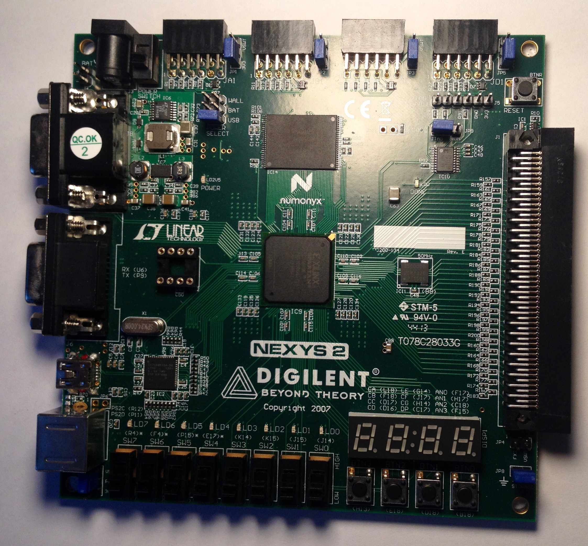

## Implementación de un prototipo del videojuego Pacman en VHDL

Este fue uno de los proyectos para la asignatura de Diseño Automático de Sistemas (DAS). Para llevarlo a cabo utilicé:

* El lenguaje VHDL
* Una FPGA Xilinx Nexys 2 Spartan 3E-500
* El entorno de desarrollo Xilinx ISE WebPack

Algunos de los componentes principales a desarrollar en la práctica fueron:

* Varios módulos de división de frecuencia encargados de generar las distintas señales de reloj para cada uno de los componentes del sistema.
* Varias máquinas de estados encargadas de llevar a cabo el movimiento de los "fantasmas".
* Varios contadores y sumadores, implementados a nivel de puertas lógicas.
* Un eliminador de rebotes
* Una memoria RAM
* Un controlador VGA, encargado de mandar la señal a un monitor externo.

  

